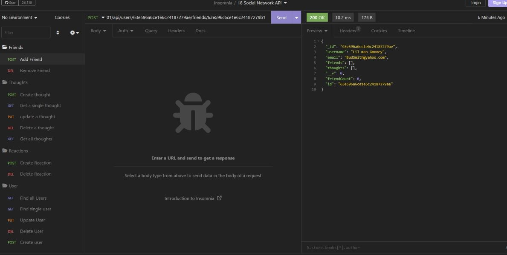
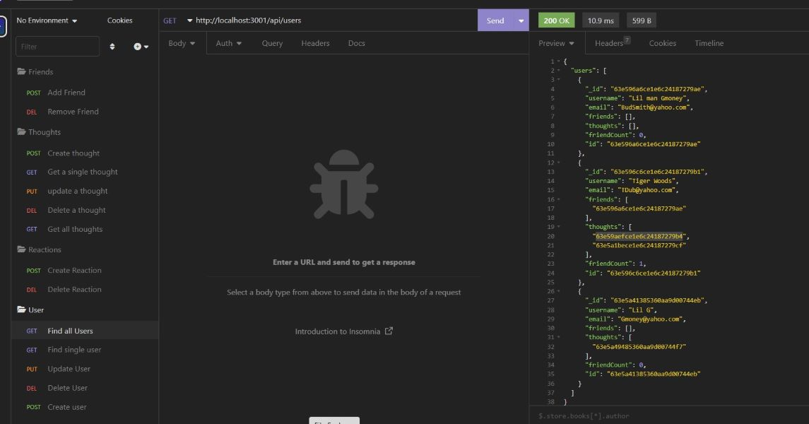
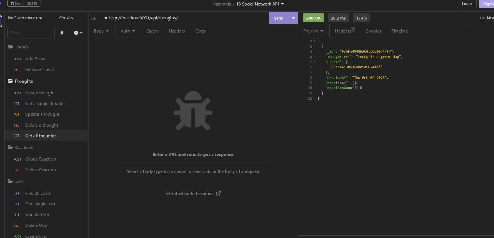

# Social-Network-APi

## Table of Content
- [Description](#description)
- [Visuals](#visuals)
- [Links](#links)

***

## Description

MongoDB is a popular choice for many social networks due to its speed with large amounts of data 

and flexibility with unstructured data. Over the last part of this course, you’ll use several of the 

technologies that social networking platforms use in their full-stack applications.
Your challenge is to build an API for a social network web application where users can share their thoughts, 

react to friends’ thoughts, and create a friend list. You’ll use Express.js for routing, a MongoDB database, 

and the Mongoose ODM. In addition to using the Express.js Links to an external site.and Mongoose Links to an 

external site.packages, you may also optionally use a JavaScript date library of your choice or the native 

JavaScript Date object to format timestamps.

***

## Visuals

***

## Links
Link to GitHub:
[Social-Network-APi](https://github.com/KMPhillips20/Social-Network-APi)

Link to walkthrough video:
[Walk-Through](https://drive.google.com/file/d/1qXh1dwev78fIrZ0CrvePf8apVfQw7wG_/view)

***